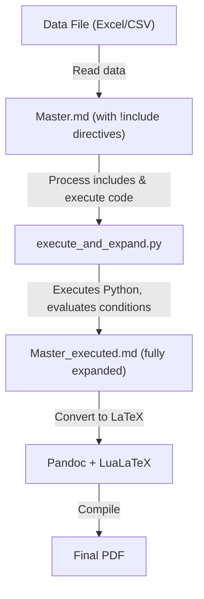

A custom notebook system that executes Python code embedded in Markdown and generates publication-ready PDFs. No Jupyter required.

> **Note:** Code examples in this post are simplified for illustration. The actual implementation includes additional error handling, edge cases, and features. A complete starter template is [available on Gumroad](https://derrekito.gumroad.com/l/jtgyzf).

## Quick Start

Get a working PDF in under 5 minutes. Choose your environment, then follow the steps.

### Step 0: Environment Setup

**Option A: Docker**

Use the [docker-latex](https://github.com/Derrekito/docker-latex) container—a LaTeX compiler tailored for Markdown-to-PDF conversion:

```bash
git clone https://github.com/Derrekito/docker-latex.git
cd docker-latex
docker build -t latex-env .
```

The image includes TeX Live, Pandoc, Python, Pygments, and Mermaid CLI.

**Option B: Native Installation (Arch Linux)**

Install core dependencies:

```bash
# TeX Live (full distribution)
sudo pacman -S texlive-meta

# Document conversion
sudo pacman -S pandoc

# Python + syntax highlighting
sudo pacman -S python python-pygments python-pip

# Mermaid diagrams (optional, for flowcharts)
sudo pacman -S nodejs npm
npm install -g @mermaid-js/mermaid-cli
```

For minted syntax highlighting, ensure `pygmentize` is in your PATH:

```bash
pygmentize -V  # Should print version
```

Create a Python virtual environment for project-specific dependencies:

```bash
python -m venv .venv
source .venv/bin/activate
pip install pandocfilters
```

### Step 1: Your First PDF

Create a file called `hello.md`:

```markdown
---
title: "My First Document"
author: "Your Name"
date: "2024-03-15"
---

# Introduction

This is a simple document with **bold** and *italic* text.

## Math Support

Inline math: $E = mc^2$

Display math:

$$
\int_0^\infty e^{-x^2} dx = \frac{\sqrt{\pi}}{2}
$$

## Code Listing

Here's some Python code (not executed, just displayed):

```python
def hello():
    print("Hello, World!")
```
```

Convert to PDF:

```bash
# Docker
docker run --rm -v "$(pwd):/app" latex-env pandoc hello.md -o hello.pdf

# Native
pandoc hello.md -o hello.pdf
```

Open `hello.pdf`. You have a professionally typeset document.

### Step 2: Add Executable Code

Now let's make the code *run*. Create `analysis.md`:

```markdown
---
title: "Analysis Report"
notebook: true
---

# Data Analysis

```python
import math

# Calculate something
result = math.sqrt(2) * math.pi
print(f"Result: {result:.4f}")
```

The code above executes and shows output below it.
```

To execute Python blocks, you need the preprocessor script. For now, here's a minimal version:

```python
#!/usr/bin/env python3
# save as: execute_notebook.py
import re
import sys

def execute_notebook(input_file):
    with open(input_file) as f:
        content = f.read()

    namespace = {}
    output_lines = []

    # Simple regex for ```python ... ``` blocks
    pattern = r'```python\n(.*?)```'
    last_end = 0

    for match in re.finditer(pattern, content, re.DOTALL):
        # Add content before this block
        output_lines.append(content[last_end:match.start()])

        code = match.group(1)
        output_lines.append(f"```python\n{code}```\n")

        # Capture print output
        from io import StringIO
        import contextlib

        stdout = StringIO()
        with contextlib.redirect_stdout(stdout):
            exec(code, namespace)

        printed = stdout.getvalue()
        if printed.strip():
            output_lines.append(f"\n**Output:**\n```text\n{printed}```\n")

        last_end = match.end()

    output_lines.append(content[last_end:])

    output_file = input_file.replace('.md', '_executed.md')
    with open(output_file, 'w') as f:
        f.write(''.join(output_lines))

    print(f"Written: {output_file}")

if __name__ == "__main__":
    execute_notebook(sys.argv[1])
```

Run the pipeline:

```bash
# Execute Python blocks
python execute_notebook.py analysis.md

# Convert to PDF
pandoc analysis_executed.md -o analysis.pdf
```

The PDF now shows both code and its output.

### Step 3: Toggle Code Visibility

The `notebook` frontmatter field controls whether code appears in the PDF.

Create two versions from the same source:

```bash
# Notebook mode (code visible) - for tutorials, auditing
pandoc analysis_executed.md -o analysis_notebook.pdf

# Report mode (code hidden) - for publication
# Change "notebook: true" to "notebook: false" in frontmatter
pandoc analysis_executed.md -o analysis_report.pdf
```

With the full system (described below), a Lua filter handles this automatically based on the frontmatter value.

### What's Next

You now have the core workflow:

1. Write Markdown with Python code blocks
2. Execute with preprocessor → `_executed.md`
3. Convert with Pandoc → PDF

The rest of this series adds:
- **Modular includes** (`!include sections/intro.md`)
- **Code block modifiers** (`{.suppress}`, `{.latex}`, `{.noexec}`)
- **Pandoc filters** for Mermaid diagrams, syntax highlighting
- **Pre-commit validation** for formatting and citations
- **Custom LaTeX environments** for styled output boxes

Continue reading for the full implementation, or grab the [complete template on Gumroad](https://derrekito.gumroad.com/l/jtgyzf) to start immediately.

---

## Problem Statement

Technical analysis reports require a workflow that:
- Embeds executable Python code alongside prose
- Generates professional PDFs with LaTeX formatting
- Supports modular, reusable content via includes
- Allows conditional content based on runtime data
- Keeps source files clean and version-controllable

Jupyter notebooks excel at exploration but are awkward for document generation. LaTeX excels at document formatting but is cumbersome for code execution. This system combines both capabilities.

## Solution: Execute and Expand

The core is a ~450-line Python script (`execute_and_expand.py`) that:

1. Parses Markdown with fenced Python code blocks
2. Executes code sequentially with persistent state
3. Processes `!include` directives (including dynamic, runtime-conditional ones)
4. Captures outputs and embeds them in the document
5. Outputs "executed" Markdown ready for Pandoc/LaTeX

### Architecture



## Basic Usage

### YAML Frontmatter

Every master document begins with YAML frontmatter that controls document behavior:

```yaml
---
title: "Analysis Report"
notebook: true
toc: true
bibliography: references/bibliography.bib
csl: ieee.csl
---
```

#### Required Fields

| Field | Purpose | Example |
|-------|---------|---------|
| `title` | Document title (appears in PDF header) | `"SEU Cross-Section Analysis"` |

#### Display Control

| Field | Values | Effect |
|-------|--------|--------|
| `notebook` | `true` | Show code blocks in PDF (tutorial/notebook mode) |
| | `false` | Hide all code blocks (report/publication mode) |
| `toc` | `true` | Generate table of contents |
| | `false` | Omit table of contents |

The `notebook` field is the key to dual-mode documents. The same source file can produce:
- **Notebook mode** (`notebook: true`): Full code + output for learning/auditing
- **Report mode** (`notebook: false`): Clean prose + results for publication

Even in notebook mode, individual blocks can be suppressed with `{.suppress}`.

#### Bibliography Fields

| Field | Purpose | Example |
|-------|---------|---------|
| `bibliography` | Path to BibTeX file | `references/bibliography.bib` |
| `csl` | Citation style (optional) | `ieee.csl`, `apa.csl` |

#### Additional Fields

| Field | Purpose | Example |
|-------|---------|---------|
| `author` | Document author(s) | `"Jane Doe"` |
| `date` | Document date | `"2024-03-15"` |
| `abstract` | Document abstract | `"This report analyzes..."` |
| `keywords` | Search keywords | `[radiation, SEU, cross-section]` |
| `documentclass` | LaTeX document class | `article`, `report` |
| `geometry` | Page geometry | `margin=1in` |
| `fontsize` | Base font size | `11pt`, `12pt` |
| `header-includes` | Raw LaTeX for preamble | Custom package imports |

#### Complete Example

```yaml
---
title: "SEU Cross-Section Analysis: Device XYZ"
author: "Test Engineering Team"
date: "2024-03-15"
abstract: |
  This report presents single-event upset cross-section measurements
  for Device XYZ under heavy-ion irradiation at TAMU cyclotron facility.
notebook: true
toc: true
bibliography: references/bibliography.bib
csl: ieee.csl
geometry: margin=1in
fontsize: 11pt
header-includes: |
  \usepackage{siunitx}
  \usepackage{booktabs}
---
```

The frontmatter is processed by Pandoc and passed to the LaTeX template. Custom templates can access any field via `$field$` syntax.

### Master Document Structure

A master document ties together the frontmatter and modular content:

```markdown
---
title: "Analysis Report"
notebook: true
toc: true
---

!include sections/01_introduction.md
!include sections/02_data-loading.md
!include sections/03_analysis.md
!include sections/04_results.md
```

### Executable Code Blocks

Standard Python fenced blocks are executed:

````markdown
```python
import pandas as pd

df = pd.read_excel(__data_file__)
print(f"Loaded {len(df)} rows")
```
````

After execution, the output appears below the code:

````markdown
```python
import pandas as pd

df = pd.read_excel(__data_file__)
print(f"Loaded {len(df)} rows")
```

**Output:**
```text
Loaded 42 rows
```
````

### Code Block Modifiers

Execution and display are controlled with CSS-like classes in curly braces after the language identifier.

#### Available Modifiers

| Modifier | Executes | Shows Code | Shows Output | Handled By |
|----------|----------|------------|--------------|------------|
| *(none)* | Yes | Yes | Yes | - |
| `{.suppress}` | Yes | No | Yes | Pandoc filter |
| `{.noexec}` | No | Yes | N/A | Python preprocessor |
| `{.nooutput}` | Yes | Yes | No | Python preprocessor |
| `{.latex}` | Yes | Yes | As raw LaTeX | Python preprocessor |

#### Processing Stages

Modifiers are handled at two stages:

1. **Python preprocessor** (`execute_and_expand.py`):
   - `.noexec` - skips execution entirely
   - `.latex` - treats `print()` output as raw LaTeX
   - `.nooutput` - executes but discards output

2. **Pandoc filter** (`notebook-toggle.lua`):
   - `.suppress` - removes code block from PDF, keeps output

#### Examples

**Suppress code, show output** - hide boilerplate setup:

````markdown
```python {.suppress}
# Reader doesn't need to see this
import matplotlib.pyplot as plt
plt.style.use('seaborn')
plt.rcParams['figure.dpi'] = 150
```
````

The PDF shows only the output, not the code.

**Show code, do not execute** - documentation examples:

````markdown
```python {.noexec}
# Example API usage (not actually run)
client = APIClient(key="your-key-here")
result = client.query("example")
```
````

**Execute silently** - setup without output clutter:

````markdown
```python {.nooutput}
CONFIG = {"threshold": 0.05, "iterations": 1000}
```
````

**Raw LaTeX output** - tables, equations, custom formatting:

````markdown
```python {.latex}
print(r"\begin{equation}")
print(r"E = mc^2")
print(r"\end{equation}")
```
````

#### Creating Custom Modifiers

To add a custom modifier, edit `execute_and_expand.py`:

```python
# Modifiers are detected by checking the code fence line:
code_fence = lines[i]  # e.g., "```python {.mymodifier}"

# Add your check:
my_flag = '.mymodifier' in code_fence

# Use in processing logic:
if my_flag:
    # Custom behavior
    pass
```

For display-only modifiers (like `.suppress`), edit `notebook-toggle.lua` to filter blocks based on class.

## LaTeX Output

The `{.latex}` modifier treats `print()` output as raw LaTeX, enabling programmatic generation of tables, equations, and styled content.

### Tables from Data

````markdown
```python {.latex}
print(r"\begin{center}")
print(r"\begin{tabular}{lrr}")
print(r"\toprule")
print(r"\textbf{Name} & \textbf{Value} & \textbf{Error} \\")
print(r"\midrule")
for name, val, err in results:
    print(rf"{name} & {val:.3f} & {err:.3f} \\")
print(r"\bottomrule")
print(r"\end{tabular}")
print(r"\end{center}")
```
````

### Equations


````markdown
```python {.latex}
print(r"\begin{equation}")
print(rf"\sigma_{{sat}} = {sigma_sat:.3e} \text{{ cm}}^2")
print(r"\end{equation}")
```
````


### Styled Output Boxes

Reusable tcolorbox environments can be defined and called from Python:

````markdown
```python {.latex}
from src.print_helpers import begin_resultbox, end_resultbox

begin_resultbox("FITTED PARAMETERS")
print(r"\begin{center}")
print(r"\begin{tabular}{ll}")
print(rf"$\sigma$ & ${sigma:.3e}$ \\")
print(rf"$\alpha$ & ${alpha:.3f}$ \\")
print(r"\end{tabular}")
print(r"\end{center}")
end_resultbox()
```
````

The helper functions emit the LaTeX boilerplate:

```python
def begin_resultbox(title="RESULT"):
    print(r"\begin{resultbox}[title={\textcolor{white}{\textbf{" + title + r"}}}]")

def end_resultbox():
    print(r"\end{resultbox}")
```

### Dynamic Styling

Box colors can change based on validation results:


````markdown
```python {.latex}
if test_passed:
    color = "green!70!black"
    status = "PASS"
else:
    color = "red!70!black"
    status = "FAIL"

print(rf"\begin{{statusbox}}{{{color}}}[title={{\textcolor{{white}}{{\textbf{{{status}}}}}}}]")
print(rf"Result: {value:.3f}")
print(rf"Threshold: {threshold:.3f}")
print(r"\end{statusbox}")
```
````


### Inline Math in Markdown

Outside of code blocks, standard LaTeX math syntax applies:

```markdown
The coefficient was $\alpha = 1.23 \times 10^{-5}$.

For display equations:

$$
\chi^2 = \sum_{i=1}^{n} \frac{(O_i - E_i)^2}{E_i}
$$
```

## Persistent State

All code blocks share a namespace. Variables defined in one block are available in subsequent blocks:

````markdown
```python
# Block 1: Load data
df = pd.read_excel(__data_file__)
USE_BOOTSTRAP = len(df) > 10
```

```python
# Block 2: Uses variables from Block 1
if USE_BOOTSTRAP:
    results = run_bootstrap(df, n_iterations=1000)
```
````

## Dynamic Includes

A powerful capability: conditionally include content based on runtime state.

Printing an `!include` statement from code causes the preprocessor to process it:

````markdown
```python
if event_count > 0:
    print("!include methods/standard_analysis.md")
else:
    print("!include methods/zero_event_handling.md")
```
````

The preprocessor:
1. Executes the code
2. Sees `!include` in the output
3. Processes the include
4. **Recursively executes code in the included file**

This enables data-driven document assembly.

## Auto-Figure Embedding

The script monkey-patches `matplotlib.figure.Figure.savefig` to track saved figures. When code saves a PDF figure:

```python
fig, ax = plt.subplots()
ax.plot(x, y)
fig.savefig("output/my_plot.pdf")
```

The figure reference is automatically inserted:

```markdown

```

No manual image embedding is required.

## Bibliography and Citations

Pandoc's citation syntax works with a BibTeX bibliography.

### Setup

Add bibliography to the YAML front matter:

```yaml
---
title: "My Report"
bibliography: references/bibliography.bib
csl: ieee.csl  # Optional citation style
---
```

### Citing Sources

Use `\cite{key}` in `.latex` blocks or raw LaTeX output:

```latex
According to \cite{smith2023}, the effect was significant.

Multiple citations \cite{smith2023,jones2024} support this.
```

### Bibliography File

Standard BibTeX format in `references/bibliography.bib`:

```bibtex
@article{smith2023,
  title   = {The Effect of X on Y},
  author  = {Smith, John and Doe, Jane},
  journal = {Journal of Examples},
  year    = {2023},
  volume  = {42},
  pages   = {1--10}
}

@inproceedings{jones2024,
  title     = {A New Approach},
  author    = {Jones, Alice},
  booktitle = {Conference Proceedings},
  year      = {2024}
}
```

### Validation

The pre-commit validator checks that all `\cite{key}` references exist in the bibliography:

```bash
make verify-citations
```

## PDF Pipeline

After execution, Pandoc converts the Markdown to LaTeX, which LuaLaTeX compiles to PDF:

```bash
#!/bin/bash
# Simplified version of create_pdf.sh

pandoc "$INPUT" \
  --from markdown+raw_tex \
  --template=template.latex \
  --lua-filter=include-files.lua \
  --lua-filter=notebook-toggle.lua \
  --filter=pandoc-minted.py \
  -o "$OUTPUT.tex"

latexmk -lualatex -shell-escape "$OUTPUT.tex"
```

Key Pandoc filters:
- **include-files.lua**: Handles `!include` directives Pandoc does not process
- **notebook-toggle.lua**: Respects `notebook: true/false` to show/hide code
- **pandoc-minted.py**: Syntax highlighting via minted package

## Makefile Integration

A Makefile orchestrates the pipeline:

```make
NOTEBOOK ?= Project
SCRIPTS  := notebooks/scripts
PIPELINE := .pdf_pipeline/scripts

.PHONY: notebook notebook-execute notebook-pdf clean-notebooks

notebook: notebook-execute notebook-pdf

notebook-execute:
	python $(SCRIPTS)/execute_and_expand.py \
	  notebooks/$(NOTEBOOK)_Master.md \
	  --output notebooks/$(NOTEBOOK)_Master_executed.md

notebook-pdf:
	$(PIPELINE)/build-pdf.sh notebooks/$(NOTEBOOK)_Master_executed.md

clean-notebooks:
	rm -f notebooks/*_executed.md
	rm -rf notebooks/output/*
```

Usage:

```bash
make notebook NOTEBOOK=BrainChip   # Full pipeline
make notebook-execute              # Execute only (no PDF)
make notebook-pdf                  # PDF only (from existing executed file)
```

## Validation

Pre-commit hooks catch errors before they enter version control:

```make
.PHONY: verify verify-structure verify-citations

verify: verify-structure verify-citations
	@echo "All checks passed"

verify-structure:
	@.validation/scripts/structural-validator.sh

verify-citations:
	@.validation/scripts/citation-validator.sh
```

```bash
make verify           # Run all checks
make verify-structure # Check includes only
```

## Directory Structure

```text
project/
├── notebooks/
│   ├── *_Master.md           # Master documents
│   ├── ProjectA/             # Modular sections
│   │   ├── 10_intro.md
│   │   ├── 20_data.md
│   │   └── 30_analysis.md
│   ├── common/               # Shared content
│   │   ├── theory/           # Reusable appendices
│   │   └── methods/          # Shared implementations
│   ├── scripts/              # execute_and_expand.py
│   ├── src/                  # Python utilities
│   ├── data/                 # Input data files
│   ├── output/               # Generated figures
│   └── pdf/                  # Final PDFs
├── .pdf_pipeline/
│   ├── latex/
│   │   ├── template.latex
│   │   └── filters/
│   └── scripts/
│       └── create_pdf.sh
└── Makefile
```

## Example: Conditional Appendices

Real-world use case: include statistical method appendices only when that method was used:

````markdown
```python
# Determine which methods apply based on data
has_zero_events = (df['events'] == 0).any()
used_bootstrap = n_events >= 10

# Dynamically include relevant theory
if has_zero_events:
    print("!include common/theory/ZeroEventMethods.md")

if used_bootstrap:
    print("!include common/theory/BootstrapTheory.md")
```
````

The generated PDF only includes appendices for methods actually used in the analysis.

## Comparison with Jupyter

| Feature | Jupyter | This System |
|---------|---------|-------------|
| Code execution | Yes | Yes |
| Version control | Awkward (JSON) | Clean (Markdown) |
| Modular includes | No | Yes |
| Conditional content | No | Yes |
| LaTeX output | Limited | Native |
| PDF generation | nbconvert (limited) | Full LaTeX |
| Reproducibility | Cell order issues | Sequential by design |

## Limitations

- **Not interactive**: No cell-by-cell execution during development
- **Python only**: Extension to other languages is possible but has not been needed
- **Requires LaTeX**: Full TeX Live install for PDF generation
- **Single namespace**: All code shares state (feature and limitation)
- **Setup required**: Needs Python venv (`make venv`) and dependencies installed

For interactive development, vim-medieval or similar tools can execute individual blocks, then the full preprocessor runs for document generation.

## Summary

This system bridges the gap between executable notebooks and publication-quality documents. The key insight: treating `!include` directives as executable enables data-driven document assembly. Combined with Pandoc's flexibility and LaTeX's typesetting, reproducible, professional technical documents can be generated.

A complete starter template with all features described in this series is [available on Gumroad](https://derrekito.gumroad.com/l/jtgyzf).
