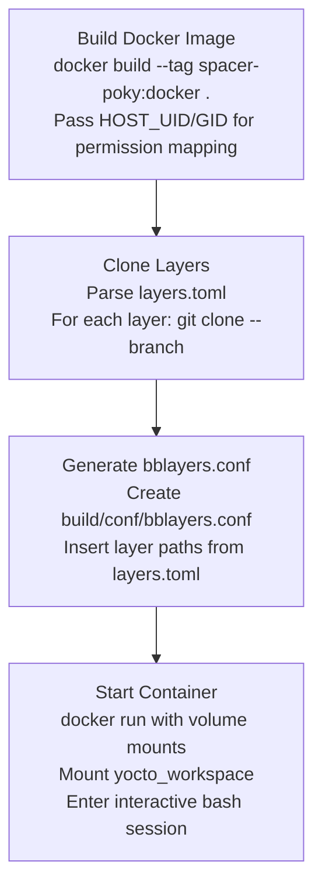
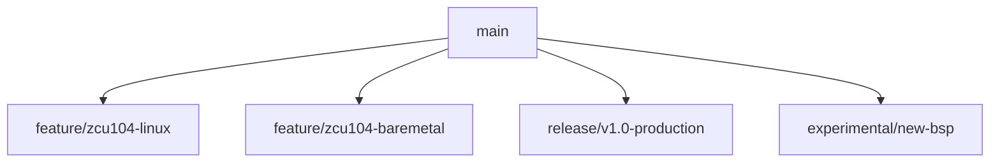

The Yocto Project provides a powerful framework for creating custom embedded Linux distributions, but configuration management remains a persistent challenge. Layer dependencies, branch coordination, and environment reproducibility require careful attention across development teams and CI/CD pipelines. YoctoForge addresses these challenges through declarative layer management and containerized build orchestration.

## Quick Start

Get a working Yocto build environment in under 10 minutes.

### 1. Create Project Structure

```bash
mkdir yoctoforge-demo && cd yoctoforge-demo
```

### 2. Create layers.toml

```toml
# layers.toml - Declarative layer specification

[layers.poky]
url = "git://git.yoctoproject.org/poky"
branch = "scarthgap"

[layers.meta-openembedded]
url = "https://github.com/openembedded/meta-openembedded.git"
branch = "scarthgap"
```

### 3. Create Dockerfile

```dockerfile
FROM ubuntu:22.04

ARG UID=1000
ARG GID=1000

ENV DEBIAN_FRONTEND=noninteractive

# Yocto build dependencies
RUN apt-get update && apt-get install -y \
    gawk wget git diffstat unzip texinfo gcc build-essential \
    chrpath socat cpio python3 python3-pip python3-pexpect \
    xz-utils debianutils iputils-ping python3-git python3-jinja2 \
    python3-subunit zstd liblz4-tool file locales libacl1 \
    && rm -rf /var/lib/apt/lists/*

# Set locale
RUN locale-gen en_US.UTF-8
ENV LANG=en_US.UTF-8

# Create build user with host UID/GID
RUN groupadd -g ${GID} yocto && \
    useradd -m -u ${UID} -g ${GID} -s /bin/bash yocto

USER yocto
WORKDIR /home/yocto/workspace

CMD ["bash"]
```

### 4. Create Makefile

```make
SHELL := /bin/bash
.ONESHELL:

IMAGE_NAME    := yoctoforge
CONTAINER_NAME := yoctoforge-build
WORK_DIR      := yocto_workspace
TOML_FILE     := layers.toml

HOST_UID := $(shell id -u)
HOST_GID := $(shell id -g)

.PHONY: build clone generate-conf attach clean

build: clone generate-conf
	docker build --tag $(IMAGE_NAME) . \
		--build-arg UID=$(HOST_UID) \
		--build-arg GID=$(HOST_GID)
	docker run -d --name $(CONTAINER_NAME) \
		-v $(PWD)/$(WORK_DIR):/home/yocto/workspace \
		$(IMAGE_NAME) tail -f /dev/null
	docker exec -it $(CONTAINER_NAME) bash

clone:
	@mkdir -p $(WORK_DIR)
	@python3 -c 'import tomllib, subprocess, os; \
cfg = tomllib.load(open("$(TOML_FILE)", "rb")); \
layers = cfg.get("layers", cfg); \
[subprocess.run(["git", "clone", "--depth", "1", "--branch", m.get("branch", "master"), m["url"], "$(WORK_DIR)/" + n]) \
 for n, m in layers.items() if not os.path.exists("$(WORK_DIR)/" + n)]'

generate-conf:
	@mkdir -p $(WORK_DIR)/build/conf
	@echo 'BBLAYERS ?= " \' > $(WORK_DIR)/build/conf/bblayers.conf
	@python3 -c 'import tomllib; \
cfg = tomllib.load(open("$(TOML_FILE)", "rb")); \
[print("  $${TOPDIR}/../" + n + " \\\\") for n in cfg.get("layers", cfg)]' >> $(WORK_DIR)/build/conf/bblayers.conf
	@echo '"' >> $(WORK_DIR)/build/conf/bblayers.conf

attach:
	docker start $(CONTAINER_NAME) 2>/dev/null || true
	docker exec -it $(CONTAINER_NAME) bash

clean:
	-docker stop $(CONTAINER_NAME) 2>/dev/null
	-docker rm $(CONTAINER_NAME) 2>/dev/null
```

### 5. Build and Enter Environment

```bash
make build
```

This clones layers, generates `bblayers.conf`, builds the Docker image, and drops you into the container.

### 6. Initialize BitBake and Build

Inside the container:

```bash
source poky/oe-init-build-env build
bitbake core-image-minimal
```

The first build takes 1-4 hours depending on hardware. Subsequent builds use cached artifacts.

---

## Problem Statement

Yocto-based development accumulates configuration complexity:

1. **Layer management sprawl**: Projects typically require 5-15 layers from different sources (Poky, OpenEmbedded, vendor BSPs, custom layers), each with specific branch or tag requirements
2. **Manual bblayers.conf maintenance**: Adding or removing layers requires editing configuration files and ensuring path correctness
3. **Environment drift**: Developers working on different machines encounter inconsistent build failures due to toolchain or dependency mismatches
4. **Branch coordination**: Hardware targets, software configurations, and release versions each demand different layer combinations
5. **Onboarding friction**: New team members spend hours configuring environments before executing their first build

Traditional approaches involve README files with clone instructions, shell scripts that break across environments, or proprietary build systems that lock teams into specific workflows. These solutions fail to provide the reproducibility and auditability that modern infrastructure practices demand.

## Technical Background

### BitBake Layer Architecture

BitBake, the task execution engine underlying Yocto, organizes metadata into layers. Each layer provides recipes (build instructions), classes (shared functionality), and configuration files. The `bblayers.conf` file declares which layers participate in a build:

```bash
BBLAYERS ?= " \
  /path/to/poky/meta \
  /path/to/poky/meta-poky \
  /path/to/meta-openembedded/meta-oe \
  /path/to/meta-custom \
"
```

Layer ordering matters. BitBake processes layers in the order listed, with later layers able to override earlier definitions through `.bbappend` files. Incorrect ordering produces subtle build failures or unexpected package versions.

### Reproducibility Challenges

Several factors complicate reproducible Yocto builds:

| Challenge | Manifestation |
|-----------|---------------|
| Layer version drift | Repository HEAD moves between builds |
| Path dependencies | Absolute paths in configuration break on different machines |
| Missing layer clones | Developer forgets to clone a dependency layer |
| Branch mismatches | Layer A requires branch X while Layer B pins branch Y |
| Environment variables | Build behavior changes based on host configuration |

These challenges multiply across teams. A working build on one developer's machine may fail on another's, with debugging consuming hours of investigation.

### Infrastructure-as-Code Principles

Modern infrastructure management treats configuration as version-controlled, declarative specifications. Terraform, Kubernetes, and Ansible exemplify this approach: human-readable configuration files describe desired state, and tooling reconciles actual state to match.

YoctoForge applies these principles to Yocto configuration. A `layers.toml` file declares layer sources and versions. Bootstrap tooling clones layers, generates configuration, and launches containerized build environments. The entire specification fits in version control alongside the codebase.

## The layers.toml Format

### TOML Selection Rationale

TOML (Tom's Obvious, Minimal Language) provides several advantages over alternatives for layer specification:

| Format | Advantages | Disadvantages |
|--------|------------|---------------|
| TOML | Human-readable, typed values, native table support | Less common than JSON/YAML |
| YAML | Widespread adoption, compact syntax | Indentation-sensitive, type coercion issues |
| JSON | Universal parser support | No comments, verbose syntax |
| INI | Simple, familiar | Limited nesting, no standard |

TOML's explicit table syntax maps cleanly to layer definitions. Python 3.11+ includes `tomllib` in the standard library, eliminating external dependencies for parsing.

### Schema Design

Each layer receives its own TOML table with required and optional fields:

```toml
[layers.poky]
url = "git://git.yoctoproject.org/poky"
branch = "scarthgap"

[layers.meta-xilinx]
url = "https://github.com/Xilinx/meta-xilinx.git"
branch = "scarthgap"

[layers.meta-arm]
url = "https://github.com/Xilinx/meta-arm.git"
branch = "rel-v2024.2"

[layers.meta-openembedded]
url = "https://github.com/openembedded/meta-openembedded.git"
branch = "scarthgap"
```

The naming convention `[layers.<name>]` enables parsing logic to identify layer entries while allowing future extensions (e.g., `[bsp.zcu104]` for board support package metadata).

Field definitions:

| Field | Required | Description |
|-------|----------|-------------|
| `url` | Yes | Git repository URL (HTTPS, SSH, or git:// protocol) |
| `branch` | No | Branch or tag to checkout; defaults to repository HEAD |

Omitting the `branch` field clones the default branch, which is useful for layers that follow a trunk-based development model.

### Extensibility

The TOML structure accommodates additional metadata without breaking existing parsers:

```toml
[layers.meta-custom]
url = "git@gitlab.example.com:team/meta-custom.git"
branch = "develop"
# Future fields (not currently parsed)
# priority = 10
# sublayers = ["meta-custom-bsp", "meta-custom-distro"]
```

Future versions may parse `sublayers` to handle meta-layers containing multiple sub-layers (common in meta-openembedded) or `priority` for explicit layer ordering.

## Bootstrap Workflow

### Command Interface

The bootstrap script provides three primary operations:

```bash
./bootstrap.sh build   # Full environment setup
./bootstrap.sh attach  # Reconnect to existing container
./bootstrap.sh clean   # Remove containers and images
```

The Makefile provides a cleaner interface with additional targets:

```bash
make build    # Full environment setup
make attach   # Reconnect to existing container
make clean    # Remove containers and images
make status   # Display environment configuration
make validate # Check prerequisites
```

### Makefile Implementation

The complete Makefile orchestrates the build workflow:

```make
SHELL := /bin/bash
.ONESHELL:

# Configuration
IMAGE_NAME    := yoctoforge-poky
CONTAINER_NAME := yoctoforge-build
WORK_DIR      := yocto_workspace
TOML_FILE     := layers.toml
CONF_DIR      := $(WORK_DIR)/conf
BUILD_CONF    := $(WORK_DIR)/build/conf

# Host user mapping
HOST_UID := $(shell id -u)
HOST_GID := $(shell id -g)

.PHONY: build attach clean status validate clone generate-conf docker-build

build: validate docker-build clone generate-conf
	@echo "[+] Starting container..."
	docker run -d \
		--name $(CONTAINER_NAME) \
		--privileged \
		-v $(PWD)/$(WORK_DIR):/home/yocto/workspace \
		-w /home/yocto/workspace \
		$(IMAGE_NAME) \
		tail -f /dev/null
	@echo "[+] Attaching to container..."
	docker exec -it $(CONTAINER_NAME) bash

docker-build:
	@echo "[+] Building Docker image..."
	docker build --tag $(IMAGE_NAME) . \
		--build-arg UID=$(HOST_UID) \
		--build-arg GID=$(HOST_GID)

clone:
	@echo "[+] Cloning layers from $(TOML_FILE)..."
	@mkdir -p $(WORK_DIR)
	@python3 -c ' \
import tomllib, subprocess, os; \
cfg = tomllib.load(open("$(TOML_FILE)", "rb")); \
layers = cfg.get("layers", cfg); \
[subprocess.run(["git", "clone", "--depth", "1"] + \
	(["--branch", m["branch"]] if "branch" in m else []) + \
	[m["url"], "$(WORK_DIR)/" + n], check=False) \
	for n, m in layers.items() if not os.path.exists("$(WORK_DIR)/" + n)]'

generate-conf:
	@echo "[+] Generating bblayers.conf..."
	@mkdir -p $(BUILD_CONF)
	@echo '# Auto-generated by YoctoForge. Do not edit.' > $(BUILD_CONF)/bblayers.conf
	@echo 'BBLAYERS ?= " \' >> $(BUILD_CONF)/bblayers.conf
	@python3 -c ' \
import tomllib; \
cfg = tomllib.load(open("$(TOML_FILE)", "rb")); \
layers = cfg.get("layers", cfg); \
[print("  $${TOPDIR}/../" + n + " \\\\") for n in layers]' >> $(BUILD_CONF)/bblayers.conf
	@echo '"' >> $(BUILD_CONF)/bblayers.conf
	@if [ -f "$(CONF_DIR)/local.conf" ]; then \
		cp $(CONF_DIR)/local.conf $(BUILD_CONF)/local.conf; \
		echo "[+] Copied local.conf override"; \
	fi

attach:
	@cid=$$(docker ps -aqf "name=$(CONTAINER_NAME)"); \
	if [ -z "$$cid" ]; then \
		echo "[-] No container found. Run 'make build' first."; \
		exit 1; \
	fi; \
	status=$$(docker inspect -f '{{.State.Status}}' $$cid); \
	if [ "$$status" = "exited" ]; then \
		docker start $$cid >/dev/null; \
	fi; \
	docker exec -it $$cid bash

clean:
	@echo "[+] Cleaning up..."
	-docker stop $(CONTAINER_NAME) 2>/dev/null
	-docker rm $(CONTAINER_NAME) 2>/dev/null
	-docker rmi $(IMAGE_NAME) 2>/dev/null
	@echo "[+] Clean complete"

status:
	@echo "=== YoctoForge Status ==="
	@echo "Image:     $(IMAGE_NAME)"
	@echo "Container: $(CONTAINER_NAME)"
	@echo "Workspace: $(WORK_DIR)"
	@echo ""
	@echo "Docker image:"
	@docker images $(IMAGE_NAME) 2>/dev/null || echo "  Not built"
	@echo ""
	@echo "Container status:"
	@docker ps -af "name=$(CONTAINER_NAME)" 2>/dev/null || echo "  Not running"

validate:
	@echo "[+] Validating prerequisites..."
	@command -v docker >/dev/null || { echo "[-] docker not found"; exit 1; }
	@command -v python3 >/dev/null || { echo "[-] python3 not found"; exit 1; }
	@python3 -c "import tomllib" 2>/dev/null || { echo "[-] Python 3.11+ required for tomllib"; exit 1; }
	@test -f $(TOML_FILE) || { echo "[-] $(TOML_FILE) not found"; exit 1; }
	@echo "[+] All prerequisites satisfied"
```

Key implementation details:

| Feature | Implementation |
|---------|----------------|
| `.ONESHELL` | Multi-line recipes execute in single shell |
| UID/GID capture | `$(shell id -u)` passes to Docker build |
| Inline Python | TOML parsing without external scripts |
| Idempotent clone | Skips existing directories |
| Container reuse | `attach` restarts stopped containers |

### Build Command Workflow

The `build` command executes four sequential operations:



Each step validates prerequisites before proceeding. Missing dependencies produce actionable error messages rather than cryptic failures.

### Layer Cloning Logic

The layer cloning function handles both fresh clones and existing repositories:

```bash
clone_layer_if_missing() {
    local url="$1"
    local target_dir="$2"
    local branch="${3:-}"

    if [ ! -d "$target_dir" ]; then
        if [ -n "$branch" ]; then
            git clone --branch "$branch" --depth 1 "$url" "$target_dir"
        else
            git clone --depth 1 "$url" "$target_dir"
        fi
    fi
}
```

The `--depth 1` flag creates shallow clones, significantly reducing clone time and disk usage. A full Poky repository exceeds 1 GB; a shallow clone requires approximately 200 MB.

Existing directories are skipped, enabling incremental updates. Developers can manually update specific layers without re-cloning the entire workspace.

### TOML Parsing Implementation

Python's `tomllib` module provides robust parsing:

```python
import tomllib
import sys

with open(sys.argv[1], "rb") as f:
    cfg = tomllib.load(f)

layers = cfg.get("layers", cfg)
for name, meta in layers.items():
    url = meta["url"]
    branch = meta.get("branch")
    if branch:
        print(name, url, branch)
    else:
        print(name, url)
```

The parser handles both `[layers.name]` and `[name]` table structures for flexibility. Output streams to Bash for iterative processing:

```bash
python3 parse_toml.py layers.toml | while read name url branch; do
    clone_layer_if_missing "$url" "$WORK_DIR/$name" "$branch"
done
```

## bblayers.conf Generation

### Template Generation

The `generate_bblayers_conf` function constructs a valid `bblayers.conf` from `layers.toml`:

```bash
generate_bblayers_conf() {
    local conf_dir="$WORK_DIR/build/conf"
    local toml_file="${1:-layers.toml}"

    mkdir -p "$conf_dir"

    {
        echo '# WARNING: This file is auto-generated. Do not edit manually.'
        echo 'BBLAYERS ?= " \'

        python3 -c '
import tomllib, sys
with open(sys.argv[1], "rb") as f:
    cfg = tomllib.load(f)
layers = cfg.get("layers", cfg)
for name in layers:
    print("  ${TOPDIR}/../" + name + " \\")
' "$toml_file"

        echo '"'
    } > "$conf_dir/bblayers.conf"
}
```

The generated file uses `${TOPDIR}` for relative path resolution. BitBake sets `TOPDIR` to the build directory, making `${TOPDIR}/../<layer>` resolve correctly regardless of absolute path differences between machines.

### Generated Output

A typical generated `bblayers.conf`:

```bash
# WARNING: This file is auto-generated. Do not edit manually.
BBLAYERS ?= " \
  ${TOPDIR}/../poky \
  ${TOPDIR}/../meta-xilinx \
  ${TOPDIR}/../meta-arm \
  ${TOPDIR}/../meta-openembedded \
"
```

The warning header discourages manual editing. Changes should flow through `layers.toml` modifications followed by regeneration, ensuring the declarative specification remains the source of truth.

### Override Support

For scenarios requiring manual `bblayers.conf` modifications, the bootstrap process supports override files:

```text
yocto_workspace/
├── conf/
│   ├── local.conf       # Override local.conf
│   └── bblayers.conf    # Override bblayers.conf
└── build/
    └── conf/
        ├── local.conf   # Copied from conf/ if present
        └── bblayers.conf
```

The bootstrap script copies override files from `conf/` to `build/conf/` before layer initialization:

```bash
if [ -f "$(CONF_DIR)/bblayers.conf" ]; then
    cp "$(CONF_DIR)/bblayers.conf" "$(BUILD_CONF_DIR)/bblayers.conf"
    echo "[+] Copied override bblayers.conf"
fi
```

This mechanism allows committing custom configuration while retaining declarative layer management for standard cases.

## Branch-per-Project Strategy

### Isolation Model

YoctoForge encourages using Git branches to isolate project configurations:



Each branch contains:

- `layers.toml` with project-specific layer requirements
- `conf/` overrides for `local.conf` and `bblayers.conf`
- Custom layer modifications in tracked subdirectories

Switching projects becomes a Git checkout:

```bash
git checkout feature/zcu104-baremetal
./bootstrap.sh build
```

The build process clones the correct layer versions and generates matching configuration automatically.

### Benefits

| Benefit | Description |
|---------|-------------|
| Configuration versioning | Layer requirements tracked alongside code changes |
| Parallel development | Multiple hardware targets or configurations without conflicts |
| Release isolation | Production builds pinned to specific layer commits |
| Experimentation safety | New BSP integration without affecting stable configurations |
| Audit trail | Git history shows configuration evolution |

### Branch Naming Conventions

Recommended branch naming:

| Pattern | Example | Purpose |
|---------|---------|---------|
| `feature/<target>-<variant>` | `feature/zcu104-linux` | Active development |
| `release/<version>` | `release/v2.0` | Release branches |
| `experimental/<description>` | `experimental/rust-support` | Exploratory work |
| `ci/<pipeline>` | `ci/nightly` | CI/CD specific configurations |

## Docker Integration

### UID/GID Mapping

File permission mismatches between host and container cause significant friction in containerized builds. YoctoForge solves this by passing host user credentials during image build:

```dockerfile
ARG UID=1000
ARG GID=1000

RUN groupadd -g ${GID} spacer && \
    useradd -m -u ${UID} -g ${GID} -s /bin/bash spacer
```

The bootstrap script captures host credentials:

```bash
HOST_UID="$(id -u)"
HOST_GID="$(id -g)"

docker build --tag "$IMAGE_NAME" "$CURR_DIR" \
    --build-arg UID="$HOST_UID" \
    --build-arg GID="$HOST_GID"
```

Files created within the container appear with correct ownership on the host filesystem, eliminating `chown` operations or permission errors.

### Volume Architecture

The container mounts the workspace directory for persistent storage:

```bash
docker run -d \
    --name "$cid" \
    --privileged \
    -v "$ws_host:$ws_cont" \
    -v "$XILINX_PATH:$XILINX_PATH" \
    -v /dev:/dev \
    -v /media:/media \
    -w "$ws_cont" \
    "$image" \
    tail -f /dev/null
```

| Mount | Purpose |
|-------|---------|
| `$ws_host:$ws_cont` | Yocto workspace with layers and build directory |
| `$XILINX_PATH:$XILINX_PATH` | Xilinx Vivado/Vitis tools (if present) |
| `/dev:/dev` | Device access for hardware programming |
| `/media:/media` | Removable media for image deployment |

The `--privileged` flag enables operations requiring elevated permissions, such as loopback device manipulation for image generation.

### Container Lifecycle

The `attach` command reconnects to existing containers:


```bash
attach:
    @cid=$$(docker ps -alq); \
    status=$$(docker inspect -f '{{.State.Status}}' $$cid); \
    if [ "$$status" = "exited" ]; then \
        docker start "$$cid" >/dev/null; \
    fi; \
    docker exec -it "$$cid" bash
```


This workflow preserves build state across terminal sessions. A multi-hour build can continue after disconnection by reattaching to the same container.

For detailed Docker configuration and base image construction, see the companion post on [Docker-Based Yocto/Poky Build Environments](/posts/docker-yocto-poky-build-environment/).

## CI/CD Pipeline Integration

### Pipeline Configuration

YoctoForge's declarative structure integrates cleanly with CI/CD systems. A GitLab CI example:

```yaml
stages:
  - build
  - test
  - deploy

variables:
  DOCKER_IMAGE: spacer-poky:$CI_COMMIT_REF_SLUG

build-image:
  stage: build
  script:
    - docker build --tag $DOCKER_IMAGE .
      --build-arg UID=$(id -u)
      --build-arg GID=$(id -g)
    - make clone
  artifacts:
    paths:
      - yocto_workspace/

build-core-image:
  stage: build
  needs: [build-image]
  script:
    - docker run --rm
      -v $(pwd)/yocto_workspace:/home/spacer/docker_dir
      $DOCKER_IMAGE
      bash -c "source poky/oe-init-build-env build && bitbake core-image-minimal"
  artifacts:
    paths:
      - yocto_workspace/build/tmp/deploy/images/
```

### Caching Strategies

Yocto builds benefit significantly from caching:

| Cache | Location | Impact |
|-------|----------|--------|
| sstate-cache | `yocto_workspace/sstate-cache/` | Reduces rebuild time by 90%+ |
| downloads | `yocto_workspace/downloads/` | Eliminates redundant fetches |
| Docker layers | Registry cache | Speeds image construction |

Pipeline configuration should preserve these directories across runs:

```yaml
cache:
  key: yocto-$CI_COMMIT_REF_SLUG
  paths:
    - yocto_workspace/sstate-cache/
    - yocto_workspace/downloads/
```

### Reproducible Builds

For release builds, pin layer commits explicitly:

```toml
[layers.poky]
url = "git://git.yoctoproject.org/poky"
branch = "scarthgap"
# commit = "abc123def456"  # Future: pin to specific commit
```

Combined with Docker image tagging, this ensures bit-for-bit reproducible builds across time and infrastructure.

## Workspace Organization

### Directory Structure

A complete YoctoForge workspace:

```text
YoctoForge/
├── bootstrap.sh          # Entry point script
├── Makefile              # Make-based interface
├── helper.sh             # Shared bash functions
├── Dockerfile            # Build environment image
├── layers.toml           # Declarative layer specification
├── docker-compose.yml    # Alternative container orchestration
└── yocto_workspace/      # Build workspace (gitignored)
    ├── poky/             # Cloned layer
    ├── meta-xilinx/      # Cloned layer
    ├── meta-arm/         # Cloned layer
    ├── meta-openembedded/# Cloned layer
    ├── conf/             # Override configurations
    │   ├── local.conf
    │   └── bblayers.conf
    └── build/            # BitBake build directory
        ├── conf/
        │   ├── local.conf
        │   └── bblayers.conf
        ├── tmp/          # Build output
        └── cache/        # BitBake cache
```

### Gitignore Configuration

Track configuration while ignoring build artifacts:

```gitignore
yocto_workspace/*
!yocto_workspace/conf/
!yocto_workspace/conf/local.conf
!yocto_workspace/conf/bblayers.conf
```

This pattern commits override configurations while excluding cloned layers and build output.

## Troubleshooting

### Common Issues

**"tomllib not found"**

Python 3.11+ is required. Check version:

```bash
python3 --version
```

On older systems, install `tomli` as a fallback:

```bash
pip install tomli
```

Then modify the import:

```python
try:
    import tomllib
except ImportError:
    import tomli as tomllib
```

**"Permission denied" on build artifacts**

UID/GID mismatch between host and container. Rebuild the image:

```bash
make clean
make build
```

**"do_fetch: Fetcher failure"**

Network issues or incorrect layer URL. Verify:

```bash
git ls-remote <url>  # Test URL accessibility
```

For corporate networks, configure git proxy:

```bash
git config --global http.proxy http://proxy:port
```

**"Nothing PROVIDES 'package'"**

Missing layer dependency. Common solutions:

| Missing | Add Layer |
|---------|-----------|
| Python packages | `meta-openembedded/meta-python` |
| Networking tools | `meta-openembedded/meta-networking` |
| Qt/GUI | `meta-qt5` or `meta-qt6` |

Update `layers.toml` and regenerate:

```bash
make clone
make generate-conf
```

**Build runs out of disk space**

Yocto builds require 50-100GB free. Check usage:

```bash
df -h yocto_workspace/
du -sh yocto_workspace/build/tmp/
```

Clean old build artifacts:

```bash
# Inside container
bitbake -c cleansstate <recipe>

# Or remove tmp entirely (forces full rebuild)
rm -rf build/tmp
```

**Slow builds**

Enable parallel builds in `local.conf`:

```bash
# yocto_workspace/conf/local.conf
BB_NUMBER_THREADS = "8"
PARALLEL_MAKE = "-j 8"
```

Match to your CPU core count.

### Debug Mode

Run individual Makefile targets to isolate issues:

```bash
make clone          # Clone layers only
make generate-conf  # Generate bblayers.conf only
make docker-build   # Build image only
```

Inspect generated configuration:

```bash
cat yocto_workspace/build/conf/bblayers.conf
```

## Summary

YoctoForge transforms Yocto project configuration from implicit, error-prone procedures into explicit, version-controlled infrastructure. The declarative `layers.toml` specification replaces scattered README instructions and brittle shell scripts. Containerized builds eliminate environment discrepancies across developer machines and CI systems.

Key capabilities:

- **Declarative layer management**: Single TOML file specifies all layer dependencies
- **Automatic configuration generation**: bblayers.conf generated from specification
- **Branch-per-project isolation**: Git branches encapsulate complete project configurations
- **Docker integration**: Consistent build environments with proper UID/GID mapping
- **CI/CD compatibility**: Structured workflow integrates with standard pipeline systems

This approach treats embedded Linux configuration as infrastructure-as-code, bringing the reproducibility and auditability of modern DevOps practices to Yocto-based development.

## References

- [Yocto Project Documentation](https://docs.yoctoproject.org/)
- [BitBake User Manual](https://docs.yoctoproject.org/bitbake/)
- [OpenEmbedded Layer Index](https://layers.openembedded.org/)
- [Docker-Based Yocto/Poky Build Environments](/posts/docker-yocto-poky-build-environment/) - companion post on container setup
