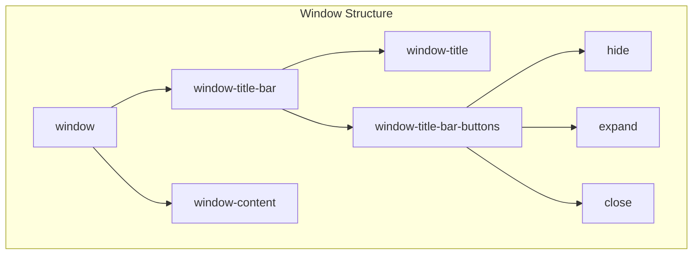

Desktop operating systems provide windowing interfaces where applications exist in movable, resizable containers. Recreating this paradigm in the browser requires no frameworks—vanilla JavaScript combined with CSS Flexbox produces a functional window manager in under 150 lines of code.

This post examines the implementation of draggable windows with title bars, window chrome buttons, and dynamic window creation.

## Architecture Overview

The window manager comprises three components:



Each window is a flex container with two children: the title bar and the content area. The title bar itself is a flex container arranging the title text and button group.

## CSS Foundation

### Window Container

The window element uses column-direction flex layout to stack the title bar above the content:

```css
:root {
  --window-button-size: 20px;
}

.window {
  display: flex;
  flex-wrap: wrap;
  flex-direction: column;
  justify-content: center;
  width: 400px;
  position: absolute;
  min-height: 150px;
  border-color: black;
  border-style: solid;
}
```

Absolute positioning enables free placement anywhere on screen. The `min-height` prevents collapse when content is minimal.

### Title Bar Layout

The title bar demonstrates flexbox's power for horizontal layouts:

```css
.window-title-bar {
  background: skyblue;
  align-items: center;
  display: flex;
  margin: 0;
  padding: 0;
  cursor: move;
  user-select: none;
}

p.window-title {
  margin-left: 15px;
  flex-direction: row;
  margin: 0;
  padding: 0;
  flex-grow: 1;
  z-index: 1;
  user-select: none;
}
```

The `flex-grow: 1` on the title causes it to expand and fill available space, pushing the button group to the right edge. The `user-select: none` property prevents text highlighting during drag operations—without this, dragging a window would select the title text.

The `cursor: move` provides visual feedback that the title bar is draggable.

### Window Chrome Buttons

The minimize, maximize, and close buttons use flex for centering icons:

```css
.window-title-bar-buttons {
  display: flex;
  flex-direction: row;
  align-items: center;
  align-self: center;
}

.window-button-close,
.window-button-expand,
.window-button-hide {
  display: flex;
  font-family: fontawesome;
  border-color: black;
  border-style: solid;
  border-width: 1px;
  padding: 1px;
  margin: 2px;
  width: var(--window-button-size);
  height: var(--window-button-size);
  align-items: center;
  justify-content: center;
  align-self: center;
}
```

CSS custom properties (`--window-button-size`) enable consistent sizing across all buttons with a single value change.

### Content Area

The content area expands to fill remaining window height:

```css
.window-content {
  background: lightgrey;
  flex-grow: 1;
}
```

## Drag Implementation

The drag system follows a standard pattern: capture initial mouse position on mousedown, calculate delta on mousemove, and clean up on mouseup.

### Event Binding

```javascript
function dragWindow(windowElmnt) {
  var x0 = 0,
      y0 = 0,
      x1 = 0,
      y1 = 0;

  windowElmnt.onmousedown = dragMouseDown;
```

Four variables track positions: `x0` and `y0` store the previous mouse position, while `x1` and `y1` store the calculated delta.

### Mouse Down Handler

```javascript
  function dragMouseDown(e) {
    e = e || window.event;
    x0 = e.clientX;
    y0 = e.clientY;
    document.onmouseup = closeDragWindow;
    document.onmousemove = windowDrag;
  }
```

The initial click position is captured, and event listeners are attached to the document (not the window element). Attaching to the document ensures drag continues even if the cursor moves faster than the element can follow.

### Mouse Move Handler

```javascript
  function windowDrag(e) {
    e = e || window.event;
    x1 = x0 - e.clientX;
    y1 = y0 - e.clientY;
    x0 = e.clientX;
    y0 = e.clientY;
    windowElmnt.style.top = (windowElmnt.offsetTop - y1) + "px";
    windowElmnt.style.left = (windowElmnt.offsetLeft - x1) + "px";
  }
```

The delta calculation (`x0 - e.clientX`) determines how far the mouse moved since the last event. This delta is subtracted from the element's current position. The previous position is then updated for the next calculation.

### Cleanup

```javascript
  function closeDragWindow() {
    document.onmouseup = null;
    document.onmousemove = null;
  }
}
```

Removing event listeners prevents memory leaks and stops drag behavior when the mouse button is released.

## Dynamic Window Creation

Windows are created programmatically rather than defined in static HTML:

```javascript
function createWindow(id) {
  // Window container
  var newWindow = document.createElement("div");
  newWindow.className = "window";
  newWindow.id = id;

  // Title bar
  var titleBar = document.createElement("div");
  titleBar.className = "window-title-bar";

  // Title text
  var title = document.createElement('p');
  title.className = "window-title";
  title.appendChild(document.createTextNode("title"));

  // Button container
  var titleBarButtons = document.createElement("div");
  titleBarButtons.className = "window-title-bar-buttons";

  // Hide button
  var windowButtonHide = document.createElement("div");
  windowButtonHide.className = "window-button-hide";
  var faMinusSquare = document.createElement('span');
  faMinusSquare.className = "far fa-minus-square";
  windowButtonHide.appendChild(faMinusSquare);

  // Expand button
  var windowButtonExpand = document.createElement("div");
  windowButtonExpand.className = "window-button-expand";
  var faSquare = document.createElement('span');
  faSquare.className = "far fa-square";
  windowButtonExpand.appendChild(faSquare);

  // Close button
  var windowButtonClose = document.createElement("div");
  windowButtonClose.className = "window-button-close";
  var faTimesCircle = document.createElement('span');
  faTimesCircle.className = "far fa-times-circle";
  windowButtonClose.appendChild(faTimesCircle);

  // Assemble button group
  titleBarButtons.appendChild(windowButtonHide);
  titleBarButtons.appendChild(windowButtonExpand);
  titleBarButtons.appendChild(windowButtonClose);

  // Content area
  var windowContent = document.createElement("div");
  windowContent.className = "window-content";
  windowContent.appendChild(document.createTextNode("content"));

  // Assemble window
  titleBar.appendChild(title);
  titleBar.appendChild(titleBarButtons);
  newWindow.appendChild(titleBar);
  newWindow.appendChild(windowContent);

  // Add to DOM and enable dragging
  document.body.appendChild(newWindow);
  dragWindow(newWindow);
}
```

FontAwesome icons provide the button graphics. The function concludes by calling `dragWindow()` to enable drag behavior on the newly created window.

## Window Operations

### Close Window

The close operation hides the window via CSS class toggle:

```javascript
function closeWindow(e) {
  e.classList.add("close-window");
}
```

```css
.close-window {
  display: none;
}
```

This approach preserves the window in the DOM for potential restoration, unlike `removeChild()` which destroys the element entirely.

### Stubbed Operations

The minimize and maximize operations require additional state tracking:

```javascript
function hideWindow() {
  // Minimize to taskbar or dock
}

function fullScreen() {
  // Expand to fill viewport
}
```

A complete implementation would store original dimensions before maximizing and restore them when toggling back to windowed mode.

## Enhancements

Several improvements would bring this closer to a production windowing system:

### Z-Index Management

Clicking a window should bring it to the front:

```javascript
var zIndexCounter = 1;

function bringToFront(windowElmnt) {
  zIndexCounter++;
  windowElmnt.style.zIndex = zIndexCounter;
}
```

Call `bringToFront()` in the mousedown handler.

### Edge Snapping

Windows could snap to screen edges when dragged nearby:

```javascript
function windowDrag(e) {
  // ... existing delta calculation ...

  var snapThreshold = 20;
  var newLeft = windowElmnt.offsetLeft - x1;
  var newTop = windowElmnt.offsetTop - y1;

  // Snap to left edge
  if (newLeft < snapThreshold) newLeft = 0;

  // Snap to top edge
  if (newTop < snapThreshold) newTop = 0;

  windowElmnt.style.top = newTop + "px";
  windowElmnt.style.left = newLeft + "px";
}
```

### Window Resizing

Resize handles at window edges and corners would enable dimension adjustment. This requires additional mouse tracking for the resize operation and cursor changes (`cursor: ew-resize`, `cursor: ns-resize`, `cursor: nwse-resize`) to indicate resize affordance.

## Browser Compatibility

The implementation uses standard DOM APIs and CSS properties supported across modern browsers:

| Feature | Support |
|---------|---------|
| Flexbox | IE 11+, all modern browsers |
| CSS Custom Properties | IE excluded, all modern browsers |
| `user-select` | Prefixed in older browsers |
| `clientX`/`clientY` | Universal support |

For IE 11 compatibility, replace CSS custom properties with static values and add `-ms-user-select: none`.

## Complete Source

The full implementation is available on [CodePen](https://codepen.io/Derrekito/pen/adZOPq).

## Conclusion

A functional window manager emerges from combining CSS Flexbox layout with JavaScript mouse event handling. The title bar's `flex-grow` property elegantly solves the classic problem of positioning elements at opposite ends of a container. The drag implementation demonstrates proper event delegation by attaching move and up handlers to the document rather than the dragged element.

The architecture supports extension: window state management, resize operations, and taskbar integration can layer onto this foundation without restructuring the core drag and create logic.
