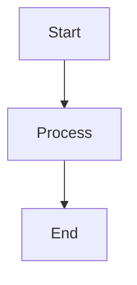

Building custom Pandoc filters to handle Mermaid diagrams, syntax highlighting, TikZ rendering, and conditional code display in a Markdown-to-PDF pipeline.

> **Note:** Code examples in this post are simplified for illustration. The actual filters include additional error handling and edge cases. A complete starter template is [available on Gumroad](https://derrekito.gumroad.com/).

## Motivation

Pandoc is powerful out of the box, but technical documentation often requires:
- Mermaid diagrams rendered to PDF-compatible images
- Syntax highlighting via minted (superior to built-in highlighting)
- TikZ graphics compiled to images for non-LaTeX outputs
- Conditional display of code blocks (notebook vs document mode)
- File includes with YAML front matter stripping

Each of these requirements necessitates a filter. Pandoc supports both Lua filters (fast, native) and JSON filters (any language via `pandocfilters`).

## Filter Chain Architecture

Filters run sequentially, transforming the AST:

```bash
pandoc input.md \
  --lua-filter=include-files.lua \
  --lua-filter=notebook-toggle.lua \
  --filter=pandoc-mermaid.py \
  --filter=pandoc-minted.py \
  -o output.pdf
```

Order matters. The recommended chain:
1. **include-files.lua** - Expand `!include` directives first
2. **notebook-toggle.lua** - Remove suppressed blocks before processing
3. **pandoc-mermaid.py** - Render diagrams (slow, skip if suppressed)
4. **pandoc-minted.py** - Apply syntax highlighting last

## Filter 1: Include Files (Lua)

Pandoc does not natively support `!include` directives. This filter adds that capability:

```lua
-- include-files.lua
function Para(el)
  local text = pandoc.utils.stringify(el)
  local path = text:match("^!include%s+(.+)$")

  if path then
    local content = read_include_file(path)
    if content then
      -- Parse without YAML metadata (strip it)
      local doc = pandoc.read(content, "markdown-yaml_metadata_block")
      return doc.blocks
    end
  end
  return el
end
```

### Key Details

**Path resolution**: Paths are relative to the input document:

```lua
function get_input_dir(meta)
  if PANDOC_STATE and PANDOC_STATE.input_files then
    local input_file = PANDOC_STATE.input_files[1]
    input_dir = pandoc.path.directory(input_file)
  end
  return meta
end
```

**YAML stripping**: Included files often have their own front matter. This must be stripped:

```lua
function strip_yaml_frontmatter(content)
  local lines = {}
  local in_frontmatter = false
  local frontmatter_ended = false
  local line_num = 0

  for line in content:gmatch("([^\n]*)\n?") do
    line_num = line_num + 1
    if line_num == 1 and line:match("^%s*%-%-%-+%s*$") then
      in_frontmatter = true
    elseif in_frontmatter and line:match("^%s*%-%-%-+%s*$") then
      in_frontmatter = false
      frontmatter_ended = true
    elseif not in_frontmatter then
      table.insert(lines, line)
    end
  end
  return table.concat(lines, "\n")
end
```

**Filter registration**: Lua filters return a table of functions:

```lua
return {
  { Meta = get_input_dir },  -- First pass: capture input directory
  { Para = Para, RawBlock = RawBlock }  -- Second pass: process includes
}
```

## Filter 2: Notebook Toggle (Lua)

Code visibility is controlled via YAML front matter:

```yaml
---
notebook: true   # Show code (tutorial mode)
notebook: false  # Hide code (report mode)
---
```

### Implementation

```lua
-- notebook-toggle.lua
function Pandoc(doc)
  local is_notebook = doc.meta.notebook

  if is_notebook == false then
    -- Document mode: suppress all code
    return doc:walk({
      CodeBlock = function() return {} end,
      Div = function() return {} end
    })
  end

  -- Notebook mode: only suppress .suppress class
  return doc:walk({
    CodeBlock = function(el)
      if el.classes:includes('suppress') then
        return {}
      end
      return el
    end
  })
end
```

### Per-Block Suppression

Even in notebook mode, specific blocks can be suppressed:

````markdown
```python {.suppress}
# Hidden setup code
API_KEY = load_secret()
```

```python
# This code shows in PDF
print("Hello!")
```
````

### Format-Aware Suppression

Suppression can be limited to LaTeX output (keeping code in HTML):

```lua
local function should_suppress()
  -- FORMAT is a global variable in Pandoc filters
  if FORMAT and FORMAT:match('latex') then
    return true
  end
  return false
end
```

## Filter 3: Mermaid Diagrams (Python)

Mermaid diagrams in Markdown must be rendered to PDF images for LaTeX:

````markdown

````

### Filter Implementation


```python
#!/usr/bin/env python3
from pandocfilters import toJSONFilter, RawBlock
import subprocess
import hashlib
import os

def mermaid(key, value, format_, meta):
    if key != "CodeBlock":
        return None

    [[ident, classes, keyvals], code] = value

    if "mermaid" not in classes:
        return None

    # Generate deterministic filename from content hash
    code_hash = hashlib.sha256(code.encode()).hexdigest()[:12]
    pdf_file = f"build/mermaid/{code_hash}.pdf"

    # Cache: skip if already rendered
    if not os.path.exists(pdf_file):
        render_mermaid(code, pdf_file)

    # Return LaTeX includegraphics
    latex = f"\\includegraphics[width=\\textwidth]{{{pdf_file}}}"
    return RawBlock("latex", latex)

if __name__ == "__main__":
    toJSONFilter(mermaid)
```


### Rendering with mmdc

The Mermaid CLI (`mmdc`) renders to PDF:

```python
def render_mermaid(code, output_path):
    # Write temp .mmd file
    with open("temp.mmd", "w") as f:
        f.write(code)

    cmd = [
        "mmdc",
        "-i", "temp.mmd",
        "-o", output_path,
        "--outputFormat", "pdf",
        "--pdfFit",
        "--cssFile", os.environ.get("MERMAID_CSS", ""),
    ]

    subprocess.run(cmd, check=True)
    os.remove("temp.mmd")
```

### Attribute Handling

Width, caption, and centering attributes are supported:

````markdown
```{.mermaid width="50%" caption="System Architecture" center="true"}
graph TD
    A --> B
```
````

Parsing and LaTeX conversion:


```python
def convert_percentage_to_tex(value):
    """Convert '50%' to '0.5\\textwidth'"""
    if value.endswith("%"):
        percentage = float(value.strip("%")) / 100
        return f"{percentage}\\textwidth"
    return value

# Build LaTeX with figure environment
if center:
    latex = f"""\\begin{{figure}}[h]\\centering
\\includegraphics[width={width}]{{{pdf_file}}}
\\caption{{{caption}}}
\\end{{figure}}"""
```


### Caching

Unchanged diagrams should not be re-rendered:

```python
def get_file_hash(content):
    return hashlib.sha256(content.encode()).hexdigest()

# Check cache
hash_file = f"{filename}.hash"
if os.path.exists(pdf_file) and os.path.exists(hash_file):
    with open(hash_file) as f:
        if f.read().strip() == get_file_hash(code):
            return  # Skip rendering

# After rendering, save hash
with open(hash_file, "w") as f:
    f.write(get_file_hash(code))
```

## Filter 4: Minted Syntax Highlighting (Python)

Pandoc's built-in highlighting is limited. Minted (via Pygments) provides superior results:


```python
#!/usr/bin/env python3
from string import Template
from pandocfilters import toJSONFilter, RawBlock, RawInline

def minted(key, value, format, meta):
    if format != 'latex':
        return

    if key == 'CodeBlock':
        [[_, classes, attrs], contents] = value
        language = classes[0] if classes else 'text'

        # Skip empty blocks
        if not contents.strip():
            return None

        # Choose environment based on class
        if 'noexec' in classes:
            env = 'exampleminted'  # Different styling
        else:
            env = 'myminted'

        latex_code = f'\\begin{{{env}}}{{{language}}}\n{contents}\n\\end{{{env}}}'

        return [RawBlock(format, latex_code)]

    elif key == 'Code':
        # Inline code
        [[_, classes, _], contents] = value
        language = classes[0] if classes else 'text'
        return [RawInline(format, f'\\mintinline{{{language}}}{{{contents}}}')]

if __name__ == '__main__':
    toJSONFilter(minted)
```


### Custom Environments

Custom minted environments are defined in the LaTeX preamble:


```latex
% In template.latex
\usepackage{minted}

% Standard code block
\newenvironment{myminted}[2][]{%
  \VerbatimEnvironment
  \begin{minted}[
    frame=lines,
    framesep=2mm,
    fontsize=\small,
    #1
  ]{#2}%
}{%
  \end{minted}%
}

% Example code (not executed) - different styling
\newenvironment{exampleminted}[2][]{%
  \VerbatimEnvironment
  \begin{minted}[
    frame=leftline,
    framesep=2mm,
    fontsize=\small,
    bgcolor=gray!10,
    #1
  ]{#2}%
}{%
  \end{minted}%
}
```


## Filter 5: TikZ to PNG (Lua)

For DOCX output, TikZ must be rendered to images:

```lua
-- tikz_to_png.lua
function CodeBlock(elem)
  if elem.classes:includes("tikz") then
    local png_file = render_tikz_to_png(elem.text)
    return pandoc.Para { pandoc.Image({}, png_file) }
  end
  return elem
end
```

### Rendering Pipeline

```lua
function render_tikz_to_png(tikz_code, output_dir, index)
  local tex_file = output_dir .. "/tikz_" .. index .. ".tex"
  local pdf_file = output_dir .. "/tikz_" .. index .. ".pdf"
  local png_file = output_dir .. "/tikz_" .. index .. ".png"

  -- Write standalone LaTeX document
  local tex_content = [[
    \documentclass{article}
    \usepackage{tikz}
    \usepackage[active,tightpage]{preview}
    \begin{document}
    \begin{preview}
    ]] .. tikz_code .. [[
    \end{preview}
    \end{document}
  ]]

  -- Compile with lualatex
  os.execute("lualatex -output-directory=" .. output_dir .. " " .. tex_file)

  -- Convert PDF to PNG with ImageMagick
  os.execute("convert -density 300 " .. pdf_file .. " " .. png_file)

  return png_file
end
```

### Path Resolution

TikZ code may reference images. Paths must be resolved before compiling:

```lua
function replace_image_paths(tikz_code)
  return tikz_code:gsub(
    "\\includegraphics(%b[])(%b{})",
    function(options, filename)
      local file = filename:match("^{(.-)}$")
      local full_path = find_image_file(file)
      return "\\includegraphics" .. options .. "{" .. full_path .. "}"
    end
  )
end
```

## Integration

### Shell Script

```bash
#!/bin/bash
# create_pdf.sh

FILTER_DIR=".pdf_pipeline/latex/filters"

pandoc "$INPUT" \
  --from markdown+raw_tex \
  --template=template.latex \
  --lua-filter="$FILTER_DIR/include-files.lua" \
  --lua-filter="$FILTER_DIR/notebook-toggle.lua" \
  --filter="$FILTER_DIR/pandoc-mermaid.py" \
  --filter="$FILTER_DIR/pandoc-minted.py" \
  --highlight-style=pygments \
  -o "$OUTPUT.tex"

latexmk -lualatex -shell-escape "$OUTPUT.tex"
```

### Environment Variables

Filters are configured via environment variables:

```bash
export MERMAID_BIN="./node_modules/.bin/mmdc"
export MERMAID_FILTER_MERMAID_CSS=".pdf_pipeline/config/mermaid.css"
export MERMAID_OUTPUT_DIR="build/mermaid_images"
```

### Directory Structure

```text
.pdf_pipeline/
├── latex/
│   ├── filters/
│   │   ├── include-files.lua
│   │   ├── notebook-toggle.lua
│   │   ├── pandoc-mermaid.py
│   │   ├── pandoc-minted.py
│   │   └── tikz_to_png.lua
│   └── template.latex
├── config/
│   ├── mermaid-config.json
│   └── mermaid.css
└── scripts/
    └── create_pdf.sh
```

## Debugging Filters

### Lua Filters

Write to stderr:

```lua
io.stderr:write("[filter-name] Processing block\n")
```

Run with `--verbose`:

```bash
pandoc input.md --lua-filter=filter.lua --verbose -o output.pdf
```

### Python Filters

Use stderr (stdout is the AST):

```python
import sys
sys.stderr.write(f"DEBUG: Processing {key}\n")
```

### AST Inspection

Examining what Pandoc parses:

```bash
pandoc input.md -t json | python -m json.tool | head -100
```

## Performance Considerations

1. **Lua vs Python**: Lua filters are approximately 10x faster (no IPC overhead)
2. **Caching**: Essential for Mermaid/TikZ (seconds per diagram)
3. **Filter order**: Place fast filters first, expensive ones last
4. **Conditional processing**: Check format early to skip unnecessary work:

```python
def my_filter(key, value, format, meta):
    if format != 'latex':
        return None  # Skip for HTML
```

## Common Pitfalls

### Wrong AST Element Type

Filters receive AST elements, not raw text:

```python
# Wrong: treating value as string
if "mermaid" in value:

# Right: unpack the structure
[[ident, classes, keyvals], code] = value
if "mermaid" in classes:
```

### Missing Return Statement

Filters must return the element (or None to keep original):

```lua
-- Wrong: no return
function Para(el)
  process(el)
end

-- Right: return the element
function Para(el)
  return process(el)
end
```

### Path Issues

Filters run from Pandoc's working directory, not the input file's:

```lua
-- Use PANDOC_STATE for input file location
local input_dir = pandoc.path.directory(PANDOC_STATE.input_files[1])
local full_path = pandoc.path.join({input_dir, relative_path})
```

## Summary

Custom Pandoc filters bridge the gap between Markdown simplicity and LaTeX power. Key insights:

- **Lua for speed**: Simple transformations (includes, toggles)
- **Python for complexity**: External tool integration (Mermaid, minted)
- **Aggressive caching**: Diagram rendering is slow
- **Order matters**: Process includes first, expensive filters last

The full filter implementations are included in the [starter template on Gumroad](https://derrekito.gumroad.com/).

## References

- [Pandoc Lua Filters Manual](https://pandoc.org/lua-filters.html)
- [pandocfilters Python Library](https://github.com/jgm/pandocfilters)
- [Mermaid CLI](https://github.com/mermaid-js/mermaid-cli)
- [Minted Package](https://ctan.org/pkg/minted)
