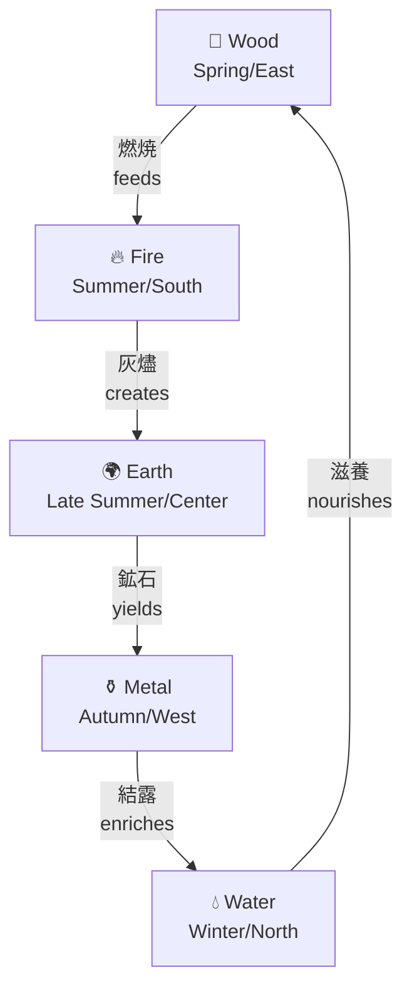

Color palette generation typically relies on mathematical relationships—complementary angles, triadic splits, or analogous ranges on the HSL color wheel. These approaches produce technically harmonious results but lack cultural resonance. The Gogyo (五行) palette generator takes a different approach: mapping colors to the Japanese Five Elements system and traversing the productive cycle to generate companions rooted in centuries of aesthetic tradition.

## Problem Statement

Modern color tools optimize for perceptual uniformity or mathematical harmony. Given an input color, algorithms calculate complementary hues at 180-degree offsets or split the wheel into equal segments. The results are visually balanced but culturally arbitrary.

Traditional color systems embed meaning. The Japanese Gogyo associates colors with seasons, directions, and natural forces. A palette derived from these associations carries implicit cultural weight—spring greens lead naturally to summer reds, which transition through harvest gold to autumn whites and winter blacks.

The challenge: create a generator that accepts a single input color, identifies its elemental affinity, and outputs four companion colors following the traditional productive cycle.

## Technical Background

### Gogyo and Wu Xing

Gogyo (五行, literally "five phases") is the Japanese adaptation of the Chinese Wu Xing system. The five elements—Wood, Fire, Earth, Metal, and Water—represent fundamental phases of transformation observed in nature.

Each element carries associations:

```
┌─────────┬─────────┬───────────┬───────────┬──────────┐
│ Element │ Season  │ Direction │ Color     │ Quality  │
├─────────┼─────────┼───────────┼───────────┼──────────┤
│ Wood    │ Spring  │ East      │ Green     │ Growth   │
│ Fire    │ Summer  │ South     │ Red       │ Expansion│
│ Earth   │ Late    │ Center    │ Yellow    │ Stability│
│         │ Summer  │           │           │          │
│ Metal   │ Autumn  │ West      │ White     │ Decline  │
│ Water   │ Winter  │ North     │ Black     │ Storage  │
└─────────┴─────────┴───────────┴───────────┴──────────┘
```

### The Productive Cycle (相生)

The elements relate through two primary cycles. The productive cycle (Sōshō, 相生) describes how each element generates the next:



- Wood feeds Fire (燃焼)
- Fire creates Earth (灰燼)
- Earth yields Metal (鉱石)
- Metal enriches Water (結露)
- Water nourishes Wood (滋養)

This cycle is generative rather than destructive. Palettes following this order progress naturally, each color leading logically to the next.

### Fixed Traditional Colors

The generator uses historically-referenced hex values for each element:

```
Wood  ████████  #2A603B  (Spring/East)
Fire  ████████  #CF3A24  (Summer/South)
Earth ████████  #FFA400  (Late Summer/Center)
Metal ████████  #FFDDCA  (Autumn/West)
Water ████████  #171412  (Winter/North)
```

ASCII representation with contrast blocks:

```
┌──────────────────────────────────────────────────┐
│  ▓▓▓▓▓▓   ▓▓▓▓▓▓   ▓▓▓▓▓▓   ▓▓▓▓▓▓   ▓▓▓▓▓▓    │
│  ▓Wood▓   ▓Fire▓   ▓Earth▓  ▓Metal▓  ▓Water▓   │
│  ▓▓▓▓▓▓   ▓▓▓▓▓▓   ▓▓▓▓▓▓   ▓▓▓▓▓▓   ▓▓▓▓▓▓    │
│  Green    Red      Gold     Cream    Near-Black │
│  #2A603B  #CF3A24  #FFA400  #FFDDCA  #171412    │
└──────────────────────────────────────────────────┘
```

## Implementation Details

### Architecture

The generator consists of three functional components:

1. **Color conversion** (hex ↔ RGB ↔ HSV)
2. **Element detection** via hue analysis
3. **Cycle traversal** for companion generation

### Hue-Based Element Detection

Each element maps to a target hue value (normalized to 0–1):

```python
element_hues = {
    "Wood":  160 / 360,  # ~0.44 (cyan-green range)
    "Fire":   10 / 360,  # ~0.03 (red range)
    "Earth":  45 / 360,  # ~0.13 (orange-yellow)
    "Metal":  35 / 360,  # ~0.10 (warm cream)
    "Water": 210 / 360,  # ~0.58 (blue, but rendered dark)
}
```

Given an input color's hue, the algorithm calculates circular distance to each target:

```python
def closest_element(hue: float) -> str:
    """Find which element the input hue is closest to (circular distance)."""
    min_dist = float("inf")
    best = "Wood"
    for name, target_hue in element_hues.items():
        dist = min(abs(hue - target_hue), 1 - abs(hue - target_hue))
        if dist < min_dist:
            min_dist = dist
            best = name
    return best
```

Circular distance handles the wrap-around at hue = 0/1 (red). A hue of 0.95 is closer to a target at 0.03 than naive subtraction would suggest.

### Grayscale Edge Cases

Near-grayscale colors lack meaningful hue information. When saturation falls below 15%, the algorithm switches to value-based classification:

```python
if s < 0.15:
    if v > 0.85:
        starting_element = "Metal"  # Bright grays → Metal
    elif v < 0.25:
        starting_element = "Water"  # Dark grays → Water
```

This mapping aligns with traditional associations: Metal correlates with white/silver tones, Water with black/deep tones.

### Cycle Traversal

Once the starting element is identified, companions are selected by walking the productive cycle:

```python
cycle = ["Wood", "Fire", "Earth", "Metal", "Water"]

start_idx = cycle.index(starting_element)
for i in range(1, 5):
    next_idx = (start_idx + i) % 5
    elem = cycle[next_idx]
    color = element_colors[elem]
```

The modulo operation ensures wrap-around: Water (index 4) leads to Wood (index 0).

### Conversion Functions

Standard hex-to-RGB and RGB-to-hex conversions use Python's stdlib `colorsys` module:

```python
from colorsys import rgb_to_hsv

def hex_to_rgb(hex_str: str):
    hex_str = hex_str.lstrip("#")
    if len(hex_str) != 6:
        raise ValueError("HEX must be 6 characters")
    return tuple(int(hex_str[i:i+2], 16) / 255.0 for i in (0, 2, 4))

def rgb_to_hex(r, g, b):
    return f"#{int(r*255):02X}{int(g*255):02X}{int(b*255):02X}"
```

The implementation requires no external dependencies beyond Python's standard library.

## Usage Examples

### Basic Invocation

```bash
python gogyo_palette.py "#2A603B"
```

Output:

```
Detected element: Wood (based on your color)
Your main color: #2A603B

4 harmonious companions (productive cycle):
  1. Fire   → #CF3A24   (Summer/South)
  2. Earth  → #FFA400   (Late summer)
  3. Metal  → #FFDDCA   (Autumn/West)
  4. Water  → #171412   (Winter/North)

Copy-paste ready for Figma/Photoshop/Coolors!
Tip: Paste the main color first, then these 4 in order for perfect Gogyō harmony.
```

### Example: Fire-Based Input

```bash
python gogyo_palette.py "#E63946"
```

Output:

```
Detected element: Fire (based on your color)
Your main color: #E63946

4 harmonious companions (productive cycle):
  1. Earth  → #FFA400   (Late summer)
  2. Metal  → #FFDDCA   (Autumn/West)
  3. Water  → #171412   (Winter/North)
  4. Wood   → #2A603B   (Spring/East)
```

The resulting palette:

```
Input   Earth   Metal   Water   Wood
┌─────┐ ┌─────┐ ┌─────┐ ┌─────┐ ┌─────┐
│█████│ │█████│ │░░░░░│ │▓▓▓▓▓│ │▒▒▒▒▒│
│█████│ │█████│ │░░░░░│ │▓▓▓▓▓│ │▒▒▒▒▒│
└─────┘ └─────┘ └─────┘ └─────┘ └─────┘
#E63946 #FFA400 #FFDDCA #171412 #2A603B
```

### Example: Grayscale Input

```bash
python gogyo_palette.py "#1A1A1A"
```

Output:

```
Detected element: Water (based on your color)
Your main color: #1A1A1A

4 harmonious companions (productive cycle):
  1. Wood   → #2A603B   (Spring/East)
  2. Fire   → #CF3A24   (Summer/South)
  3. Earth  → #FFA400   (Late summer)
  4. Metal  → #FFDDCA   (Autumn/West)
```

The low-saturation, low-value input triggers the Water classification despite lacking blue hue.

### Example: Light Gray (Metal Detection)

```bash
python gogyo_palette.py "#F5F5F5"
```

Output:

```
Detected element: Metal (based on your color)
Your main color: #F5F5F5

4 harmonious companions (productive cycle):
  1. Water  → #171412   (Winter/North)
  2. Wood   → #2A603B   (Spring/East)
  3. Fire   → #CF3A24   (Summer/South)
  4. Earth  → #FFA400   (Late summer)
```

## Complete Palette Reference

Five input scenarios demonstrating each starting element:

```
┌───────────────────────────────────────────────────────────────┐
│ Starting: Wood (#2A603B)                                      │
│ Companions: Fire → Earth → Metal → Water                      │
│ ██ #2A603B  ██ #CF3A24  ██ #FFA400  ░░ #FFDDCA  ▓▓ #171412   │
├───────────────────────────────────────────────────────────────┤
│ Starting: Fire (#CF3A24)                                      │
│ Companions: Earth → Metal → Water → Wood                      │
│ ██ #CF3A24  ██ #FFA400  ░░ #FFDDCA  ▓▓ #171412  ██ #2A603B   │
├───────────────────────────────────────────────────────────────┤
│ Starting: Earth (#FFA400)                                     │
│ Companions: Metal → Water → Wood → Fire                       │
│ ██ #FFA400  ░░ #FFDDCA  ▓▓ #171412  ██ #2A603B  ██ #CF3A24   │
├───────────────────────────────────────────────────────────────┤
│ Starting: Metal (#FFDDCA)                                     │
│ Companions: Water → Wood → Fire → Earth                       │
│ ░░ #FFDDCA  ▓▓ #171412  ██ #2A603B  ██ #CF3A24  ██ #FFA400   │
├───────────────────────────────────────────────────────────────┤
│ Starting: Water (#171412)                                     │
│ Companions: Wood → Fire → Earth → Metal                       │
│ ▓▓ #171412  ██ #2A603B  ██ #CF3A24  ██ #FFA400  ░░ #FFDDCA   │
└───────────────────────────────────────────────────────────────┘
```

## Integration Notes

### Output Format

The generator outputs human-readable text suitable for direct copy-paste into design tools. Hex codes are uppercase and include the `#` prefix for maximum compatibility with:

- Figma
- Adobe Photoshop/Illustrator
- Coolors.co
- CSS color specifications

### Extending the Implementation

Several modifications are possible without altering the core algorithm:

**Custom element colors**: Replace the `element_colors` dictionary with client-preferred values while maintaining the productive cycle logic.

**JSON output**: Wrap the output section to emit structured data for programmatic consumption.

**Destructive cycle**: The Five Elements also define a destructive cycle (相剋) where Wood depletes Earth, Earth absorbs Water, etc. An alternative palette mode could traverse this cycle for higher-contrast, tension-based schemes.

## Summary

The Gogyo palette generator provides color companions based on traditional Japanese Five Elements theory rather than mathematical color wheel divisions. Given a single input color, the algorithm:

1. Converts to HSV for hue analysis
2. Identifies the closest element via circular hue distance
3. Handles grayscale edge cases through saturation/value thresholds
4. Traverses the productive cycle to emit four companion colors

The implementation requires only Python's standard library and produces palettes with embedded cultural resonance—each color leads naturally to the next through the generative cycle of Wood, Fire, Earth, Metal, and Water.
