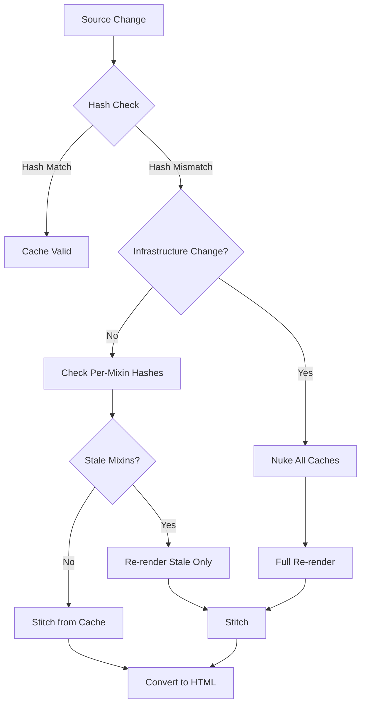

Manim caches rendered animation segments as partial video files, reusing them when the animation code hasn't changed. But Manim's cache invalidation is based on animation hashes, not source file modifications. SlideForge implements a two-level caching system: source-hash validation at the project level and content-hash validation at the mixin level. This enables selective cache invalidation—rebuild only what actually changed.

This post examines the cache invalidation architecture and the tools for managing it.

## The Cache Invalidation Problem

Manim's built-in caching works at the animation level:

```python
# Animation hash = hash(animation_class, mobject_states, parameters)
self.play(FadeIn(circle))  # cached as partial_movie_files/abc123.webm
```

If the animation code is identical, Manim reuses the cached file. But Manim doesn't track:

- Changes to imported modules (components, themes)
- Changes to the manifest (slide ordering)
- Changes to rasterized page images
- Changes to chrome overlays

A theme color change should invalidate all renders, but Manim sees no code change in the animation itself.

## Two-Level Cache Strategy

SlideForge implements two cache layers:

### Level 1: Project-Wide Source Hash

A SHA-256 hash covers all files that affect render output:

```python
SOURCE_PATTERNS = [
    "src/deck/_master.py",
    "src/deck/_anim_*.py",
    "src/slide_base.py",
    "src/themes/afrl.py",
    "src/themes/afrl_pygstyle.py",
    "src/components/*.py",
    "slides/manifest.yaml",
    "assets/pages/presentation-*.png",
    "assets/pages/chrome/*.png",
]
```

The hash computation:

```python
def compute_source_hash():
    """Compute SHA-256 over all source files that affect render output."""
    hasher = hashlib.sha256()
    source_files = []

    for pattern in SOURCE_PATTERNS:
        matches = sorted(PROJECT_ROOT.glob(pattern))
        source_files.extend(matches)

    # Sort by relative path for determinism
    unique_files = sorted(set(source_files), key=lambda f: f.relative_to(PROJECT_ROOT))

    for fpath in unique_files:
        rel = fpath.relative_to(PROJECT_ROOT)
        hasher.update(str(rel).encode())
        hasher.update(b"\0")
        hasher.update(fpath.read_bytes())

    return hasher.hexdigest()
```

Key design decisions:

1. **Path in hash**: Including the relative path prevents collisions when file contents are identical but locations differ
2. **Sorted order**: Deterministic ordering ensures the same hash regardless of filesystem traversal order
3. **Null separator**: Prevents path/content boundary ambiguity

### Level 2: Per-Mixin Content Hash

Each animation mixin has its own hash tracking:

```python
MIXIN_MAP = {
    "_run_serial_march_animation": {
        "scene": "SerialMarchStandalone",
        "source": "src/deck/_anim_serial_march.py",
    },
    "_run_cuda_exec_animation": {
        "scene": "CUDAExecStandalone",
        "source": "src/deck/_anim_cuda_exec.py",
    },
    # ...
}

def check_mixin_fresh(mixin_method, cache, force):
    """Return True if the mixin's standalone render is up-to-date."""
    if force:
        return False

    info = MIXIN_MAP[mixin_method]
    source_path = PROJECT_ROOT / info["source"]
    current_hash = file_hash(source_path)

    cached = cache.get("mixins", {}).get(mixin_method, {})
    if cached.get("hash") != current_hash:
        return False

    json_path = PROJECT_ROOT / "slides" / f"{info['scene']}.json"
    return json_path.exists()
```

The cache file (`slides/.build_cache.json`) stores per-mixin hashes:

```json
{
  "mixins": {
    "_run_serial_march_animation": {
      "hash": "a1b2c3d4...",
      "scene": "SerialMarchStandalone"
    },
    "_run_cuda_exec_animation": {
      "hash": "e5f6g7h8...",
      "scene": "CUDAExecStandalone"
    }
  }
}
```

## The Invalidation Tool

`tools/invalidate_cache.py` provides cache management:

### Hash Check

Compare current source hash against stored hash:

```bash
python tools/invalidate_cache.py --hash-check
```

Output when sources unchanged:
```
Source hash: a1b2c3d4e5f6... (147 files)
Cache up to date — no source changes detected.
```

Output when sources changed:
```
Source hash: a1b2c3d4e5f6... (147 files)
Stored hash: 9z8y7x6w5v4u...
Source files changed since last render.
  deleted: media/videos/_master/720p30/partial_movie_files/SEESoCDeck/
  deleted: media/videos/_master/1080p60/partial_movie_files/SEESoCDeck/
  deleted: slides/files/SEESoCDeck/
Nuked 3 cache directories.
```

### Hash Stamp

After a successful render, stamp the current hash:

```bash
python tools/invalidate_cache.py --hash-stamp
```

This writes the hash to `media/.source_hash` for future comparison.

### List Mixins

Show all mixins and their cached animation ranges:

```bash
python tools/invalidate_cache.py --list
```

Output:
```
Mixin Method                                  Range        Files
-----------------------------------------------------------------
_run_serial_march_animation                   [  0,  45)      45
_run_cuda_exec_animation                      [ 45,  89)      44
_run_memory_coalescing_animation              [ 89, 134)      45
_run_h100_arch_animation                      [134, 178)      44
_run_cache_march_animation                    [178, 214)      36

Total animations in concat list: 214
Cached .webm files on disk: 230
Referenced by concat list:   214
Orphaned (stale):            16
```

The "Range" column shows which animation indices each mixin owns. This mapping comes from `media/play_ranges.json`, emitted during rendering.

### Selective Invalidation

Invalidate cache for specific mixins:

```bash
# Single mixin
python tools/invalidate_cache.py _run_serial_march_animation

# Multiple mixins
python tools/invalidate_cache.py _run_serial_march_animation _run_cuda_exec_animation

# Dry run (show what would be deleted)
python tools/invalidate_cache.py --dry-run _run_serial_march_animation
```

Output:
```
Invalidating: _run_serial_march_animation
  Animation range: [0, 45) — 45 animations
  deleted: 3b4c5d6e7f8a.webm (124.5 KB)
  deleted: 9a0b1c2d3e4f.webm (89.2 KB)
  ...
Deleted 45 files (5.2 MB)
Run `make draft` to re-render invalidated animations.
```

### Clean Orphans

Remove cached files not referenced by the current concat list:

```bash
python tools/invalidate_cache.py --clean-orphans
```

Orphans accumulate when animations are removed or restructured. Cleaning them reclaims disk space.

## Integration with Make

The Makefile integrates cache management:

```make
# Hash check before render (nuke if stale)
.PHONY: cache-check
cache-check:
	python tools/invalidate_cache.py --hash-check

# Hash stamp after successful render
.PHONY: cache-stamp
cache-stamp:
	python tools/invalidate_cache.py --hash-stamp

# Full draft with cache management
.PHONY: draft
draft: cache-check render-deck cache-stamp convert-deck

# List cache status
.PHONY: cache-list
cache-list:
	python tools/invalidate_cache.py --list

# Invalidate specific mixin
.PHONY: cache-invalidate
cache-invalidate:
	@if [ -z "$(MIXIN)" ]; then \
		echo "Usage: make cache-invalidate MIXIN=_run_serial_march_animation"; \
		exit 1; \
	fi
	python tools/invalidate_cache.py $(MIXIN)

# Clean orphaned cache files
.PHONY: cache-clean-orphans
cache-clean-orphans:
	python tools/invalidate_cache.py --clean-orphans
```

## Incremental Build Flow

The incremental build workflow:



### When to Nuke Everything

The source hash covers "infrastructure" files—changes that affect all renders:

- `slide_base.py` (base class, patches)
- `themes/*.py` (colors, fonts, sizing)
- `components/*.py` (shared mobjects)
- `manifest.yaml` (slide ordering)
- Page PNGs and chrome strips

A change to any of these invalidates everything because the render output depends on them globally.

### When to Rebuild Selectively

Per-mixin hashes cover animation-specific code:

- `_anim_serial_march.py` changes → rebuild only `SerialMarchStandalone`
- `_anim_cuda_exec.py` changes → rebuild only `CUDAExecStandalone`

This is the common case during development: tweaking one animation shouldn't require rebuilding the others.

## Play Ranges: Mapping Mixins to Animations

During rendering, the deck scene emits `media/play_ranges.json`:

```python
class SEESoCDeck(ThemedSlide):
    def construct(self):
        play_ranges = {}
        start_idx = self.renderer.num_plays

        # ... render serial march ...
        self._run_serial_march_animation()
        play_ranges["_run_serial_march_animation"] = [start_idx, self.renderer.num_plays]
        start_idx = self.renderer.num_plays

        # ... render cuda exec ...
        self._run_cuda_exec_animation()
        play_ranges["_run_cuda_exec_animation"] = [start_idx, self.renderer.num_plays]

        # Write mapping
        with open("media/play_ranges.json", "w") as f:
            json.dump(play_ranges, f)
```

This maps mixin methods to animation index ranges. The invalidation tool uses this mapping to delete only the cached files belonging to a specific mixin.

## The Partial Movie File List

Manim writes a concat list for FFmpeg:

```
# media/videos/_master/720p30/partial_movie_files/SEESoCDeck/partial_movie_file_list.txt
file 'file:/manim/media/videos/_master/720p30/partial_movie_files/SEESoCDeck/3b4c5d6e.webm'
file 'file:/manim/media/videos/_master/720p30/partial_movie_files/SEESoCDeck/7f8a9b0c.webm'
...
```

The invalidation tool parses this list to:
1. Map animation indices to filenames
2. Identify orphaned files (on disk but not in list)

## Cache Size Management

A full 4K render can produce 10+ GB of cached partial files. Management strategies:

### Disk Usage Monitoring

```bash
# Check cache size
du -sh media/videos/_master/*/partial_movie_files/
```

### Quality-Specific Cleanup

```make
.PHONY: clean-draft-cache
clean-draft-cache:
	rm -rf media/videos/_master/720p30/

.PHONY: clean-publish-cache
clean-publish-cache:
	rm -rf media/videos/_master/1080p60/

.PHONY: clean-4k-cache
clean-4k-cache:
	rm -rf media/videos/_master/2160p60/
```

### Aggressive Cleanup

```make
.PHONY: clean-all-cache
clean-all-cache:
	rm -rf media/videos/
	rm -rf slides/files/
	rm -f media/.source_hash
	rm -f slides/.build_cache.json
```

## Debugging Cache Issues

### Symptom: Stale content despite changes

Check the source hash:
```bash
python tools/invalidate_cache.py --hash-check
```

If it reports "up to date" but content is stale, the changed file might not be in `SOURCE_PATTERNS`. Add it.

### Symptom: Unnecessary full rebuilds

Check what changed:
```bash
git diff --name-only HEAD~1
```

If only a mixin file changed but everything rebuilt, the source hash might be too broad. Consider splitting infrastructure files from content files.

### Symptom: Missing animations after stitch

Check the cache status:
```bash
python scripts/stitch_deck.py --check
```

This reports which mixins need re-rendering before stitching can proceed.

## Summary

SlideForge's two-level cache system balances correctness and efficiency:

1. **Source hash** catches infrastructure changes requiring full rebuild
2. **Per-mixin hash** enables selective rebuild for content changes
3. **Play ranges** map logical mixins to physical cache files
4. **Orphan cleanup** reclaims space from stale renders

The result: edit an animation, rebuild in minutes instead of hours. Change a theme color, rebuild everything automatically. The cache system makes incremental development practical for complex animated presentations.

The next post covers the mixin composition pattern—how SlideForge isolates animation logic for independent rendering and stitching.
